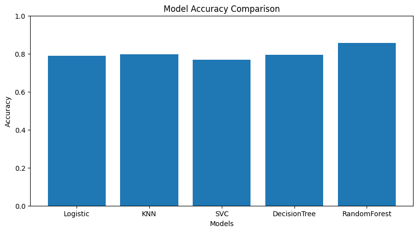

# Wine Quality Classification using Machine Learning

## Project Overview

This project implements an end-to-end machine learning classification system to predict wine quality as **Bad**, **Average**, or **Good** by combining red and white wine datasets.

The workflow covers:
- Data loading and merging
- Data preprocessing
- Exploratory data analysis (EDA)
- Multi-model classification
- Performance evaluation and cross-validation

## Dataset

- **Name:** Wine Quality Dataset (Red & White Wine)
- **Source:** UCI Machine Learning Repository
- **Files used:** `winequality-red.csv`, `winequality-white.csv`

In this notebook, data is loaded directly from the UCI URLs.

## Quality Label Mapping

- `quality <= 4` -> `Bad`
- `quality 5-6` -> `Average`
- `quality >= 7` -> `Good`

## Technologies Used

- Python
- Pandas
- NumPy
- Matplotlib
- Seaborn
- Scikit-learn

## Project Workflow

1. Load and merge red and white wine datasets
2. Perform EDA and class distribution checks
3. Handle missing values using mean imputation
4. Detect and treat outliers using IQR clipping
5. Encode categorical variables (`wine_type`)
6. Scale features with Min-Max Scaler
7. Split data into train/test sets
8. Train multiple classification models
9. Evaluate using accuracy, confusion matrix, and classification report
10. Compare models with 5-fold cross-validation

## Machine Learning Models Implemented

- Logistic Regression
- K-Nearest Neighbors (KNN)
- Support Vector Classifier (SVC)
- Decision Tree Classifier
- Random Forest Classifier

## Model Accuracy Comparison

The following chart summarizes the test accuracy of the benchmarked models used in this project:



## Evaluation Metrics

- Accuracy Score
- Confusion Matrix
- Classification Report (Precision, Recall, F1-score)
- 5-Fold Cross-Validation

## Project Structure

```text
Wine-Quality-Classification-ML/
|-- wine_quality_classification.ipynb
|-- README.md
```

## How to Run

1. Install dependencies:

```bash
pip install numpy pandas matplotlib seaborn scikit-learn jupyter
```

2. Launch Jupyter Notebook:

```bash
jupyter notebook
```

3. Open and run:

```text
wine_quality_classification.ipynb
```

## Future Improvements

- Hyperparameter tuning with `GridSearchCV`
- Feature importance analysis
- Class imbalance handling
- Testing advanced ensemble methods
